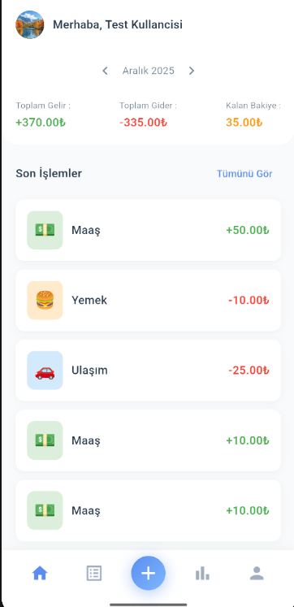
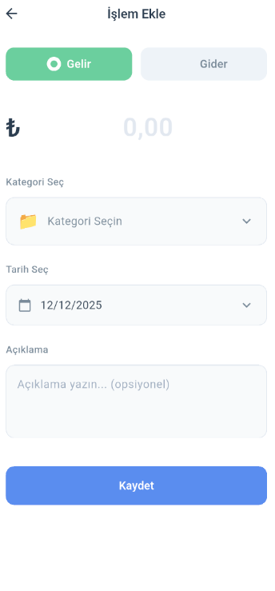
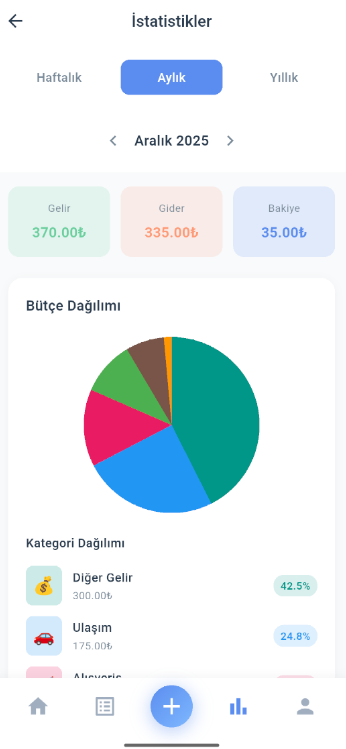

# Mangır - Personal Finance Management System

**Mangır** is a modern, full-stack personal finance application designed to help users track their income and expenses with ease. The project features a secure, high-performance architecture with a mobile-first approach.

## 🚀 Key Features

- **Secure Authentication:** JWT-based Access & Refresh token system with encrypted password storage (Bcrypt).
- **Comprehensive Tracking:** Full CRUD operations for managing daily financial transactions.
- **Advanced Data Visualization:** Custom-built interactive pie charts (using Flutter's `CustomPainter`) for budget distribution analysis.
- **Periodic Reporting:** Filter and view financial data across weekly, monthly, and yearly timeframes.

## 🛠️ Tech Stack

| Component           | Technologies Used                     |
| :------------------ | :------------------------------------ |
| **Mobile Frontend** | Flutter, Dart                         |
| **Backend API**     | Python, FastAPI                       |
| **Database & ORM**  | MySQL, SQLAlchemy                     |
| **Security**        | JWT (JSON Web Tokens), Bcrypt Hashing |
| **API Docs**        | Swagger UI                            |

## 🏗️ System Architecture

The application is built on a **3-tier architecture** to ensure modularity and scalability:

1.  **Presentation Layer:** Flutter-based mobile application.
2.  **Application Layer:** Python FastAPI RESTful services managing business logic.
3.  **Data Layer:** MySQL relational database for persistent storage.

## ⚙️ Installation & Setup

### 1. Backend Setup (FastAPI)

```bash
# Navigate to backend directory
cd mangir_backend

# Create a virtual environment
python -m venv venv

# Activate the virtual environment
venv\Scripts\activate

# Install dependencies
pip install -r requirements.txt

# Environment Variables
# Copy .env.example to .env and update your database credentials
cp .env.example .env

# Run the server
uvicorn main:app --reload
```

### 2. Frontend Setup (Flutter)

```bash
# Navigate to frontend directory
cd mangir

# Install packages
flutter pub get

# API Configuration
# Ensure the baseUrl in lib/services/api_service.dart matches your local server IP (e.g., 10.0.2.2 for Android Emulator)

# Run the application
flutter run
```

## 📸 Project Showcase

<p align="center">
  
  
  
</p>
